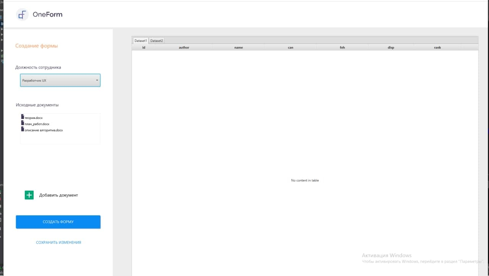

## UI для создания инструкций-одностраничников
1.Описание \
Данное приложение было создано в рамках хакатона "Цифровой прорыв". Задача: Автоматическое создание "одностраничников"содержащих краткие инструкции на основе совокупности нормативной документации.
    Настоящее приложение являось UI частью и предназначалось для вывода из базы данных предварительно обработанных
блоков информации, с частичной заменой части текста на подходящие по содержанию графические материалы.

2.Используемые технологии \
        - среда JavaFX \
        - Java 1.8 \
        - PostgreSQL
    
3.Приложение является десктопным,для полноценного функционирования необходима бэк часть автором которой я не являюсь

4.Реализовано:
    - три фронт странички в формате FXML
    - main контролер
    - контролеры страниц
    - java классы - адаптеры для взаимодействия с бэк частью  

